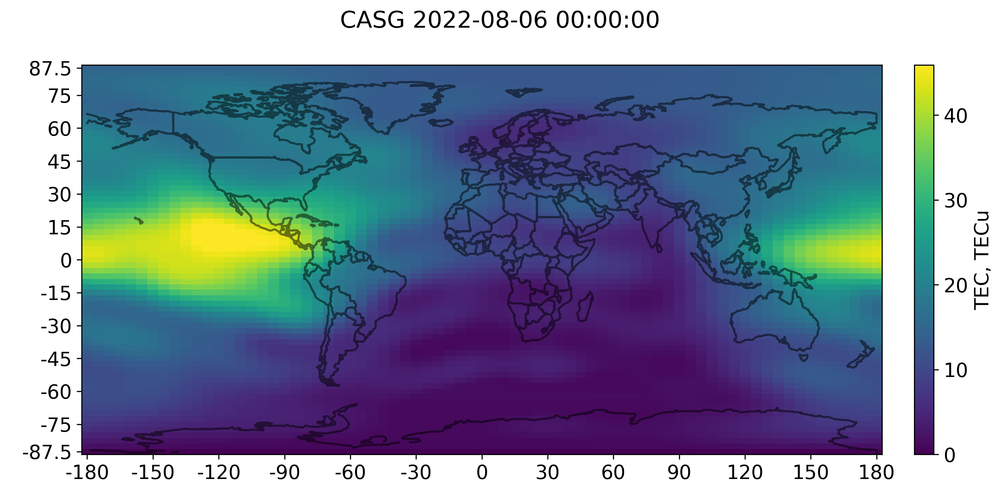

IONEX formatter
===============

Data format to exchange ionospheric maps like on the Figure below:

Implements IONosphere map Exchange [format](https://files.igs.org/pub/data/format/ionex1.pdf)
and writes data in corresponding format to a file. Each file could contain
several maps, in general file contain maps for a single day. The file names 
also follows the file name convention `cccedddh.yyI`:

* ccc - 3 character analysis center designator
* e - extension for region code (G for Global Ionospheric Map)
* ddd - day of year of the first record (map) in a file
* h - file index (1, 2 ...) or hour (A, B ...) within a day. Letter are used 
for hours since it need to fit one character.
* yy - two last digits in year
* I - file type (I for ionospheric maps)

Use cases 
---------

Currently CSV to IONEX format conversion is implemented. CSV data should have
time, lattitude and longitude specification for each data point. Assume we 
have file `data.csv` with following content.

.. code-block:: csv

    #year month day_of_month hour minute second    lat    lon     val 
    ....
    2010     12           28   10      0      0   52.5  100.0   54.56
    2010     12           28   10      0      0   52.5  105.0   52.50
    ....
    2010     12           28   10     15      0   52.5  100.0   50.60
    2010     12           28   10     15      0   52.5  105.0   49.10
    ....

Usage:

.. code-block:: bash
    python -m ionex_formatter --center mos --in data.csv --out /path/to/maps

Support
-------

If you are having issues, please let us know: artemvesnin@gmail.com

How to contribure
-----------------

1. Implement validation using [ionex reader](https://github.com/gnss-lab/ionex)
2. GUI client for data conversion
3. Microservise with FastAPI to make converter available online

License
-------

The project is licensed under the MIT license.
